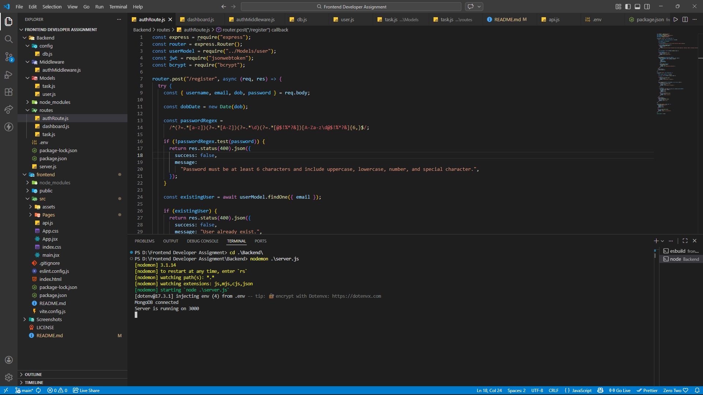
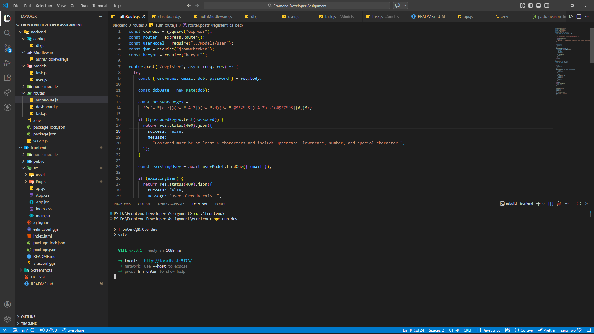
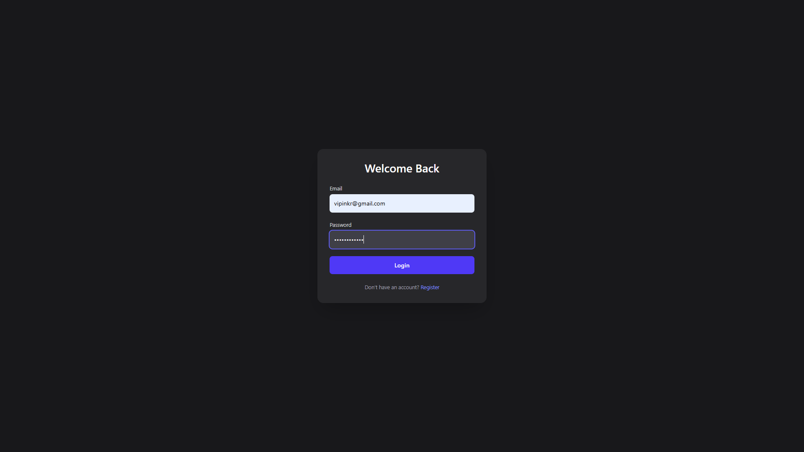
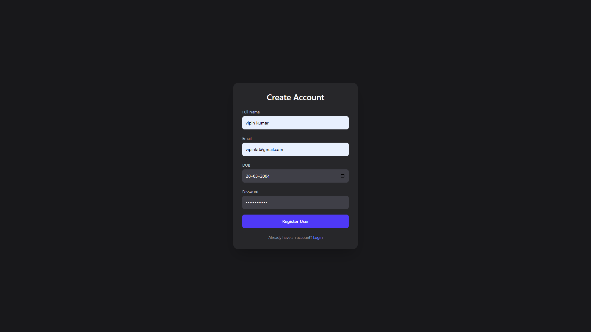
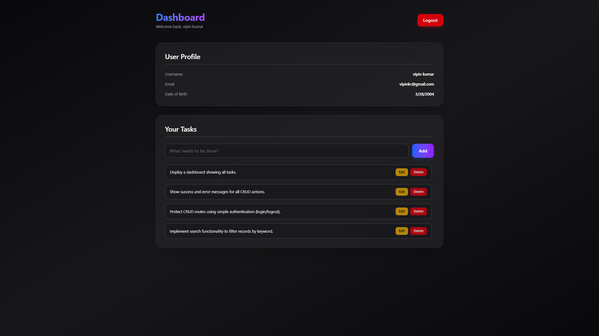

# 🚀 Secure Task Management System

Full-stack **Task Manager Dashboard** with secure JWT authentication (httpOnly cookies), protected routes, user-specific tasks, and complete **CRUD** functionality.

Modern, production-ready authentication practices + responsive UI.

[](https://react.dev/)
[](https://nodejs.org/)
[](https://www.mongodb.com/)
[](https://tailwindcss.com/)
[](https://opensource.org/licenses/MIT)

## ✨ Features

### 🔐 Authentication

- Register / Login with strong password validation
- JWT + **httpOnly**, **Secure**, **SameSite** cookies
- Secure logout (cookie clearing)
- Backend route protection via middleware
- Frontend protected routes + auto-redirect

### 📊 Dashboard & Tasks

- Protected dashboard with user verification on mount
- **Private tasks** — each user sees only their own tasks
- Full **CRUD** operations:
  - Create task
  - List all user tasks
  - Update task (title, description, status)
  - Delete task
- Responsive & clean UI with Tailwind CSS

## 🛠️ Tech Stack

| Layer    | Technologies                                             |
| -------- | -------------------------------------------------------- |
| Frontend | React 18, React Router v6, Tailwind CSS, Vite, Fetch API |
| Backend  | Node.js, Express.js, MongoDB + Mongoose                  |
| Auth     | JWT (jsonwebtoken), bcrypt, cookie-parser                |
| Security | httpOnly + Secure cookies, CORS, input validation        |
| Other    | dotenv, nodemon (dev)                                    |

## 🔒 Authentication Flow (How it works)

1. User registers → password hashed with **bcrypt**
2. User logs in → valid credentials → JWT signed
3. JWT stored in **httpOnly cookie** (not accessible via JavaScript)
4. Every protected request → cookie sent automatically → middleware verifies JWT
5. Logout → clear cookie + 200 response
6. Frontend checks auth status → redirects to login if invalid/expired

## 📦 Dependencies

### Backend

```bash

 "dependencies": {
    "bcrypt": "^6.0.0",
    "cookie-parser": "^1.4.7",
    "cors": "^2.8.6",
    "dotenv": "^17.3.1",
    "express": "^5.2.1",
    "jsonwebtoken": "^9.0.3",
    "mongoose": "^9.2.1"
  }
```

### Frontend

```bash

 "dependencies": {
    "@tailwindcss/vite": "^4.2.0",
    "react": "^19.2.0",
    "react-dom": "^19.2.0",
    "react-router-dom": "^7.13.0",
    "tailwindcss": "^4.2.0"
  }
```

## 📂 Project Structure

```text
Task-Manager-MERN/
├── backend/
│   ├── config/
│   │   └── db.js
│   ├── middleware/
│   │   └── authMiddleware.js
│   ├── models/
│   │   ├── Task.js
│   │   └── User.js
│   ├── routes/
│   │   ├── auth.js
│   │   ├── dashboard.js        # optional / user info
│   │   └── tasks.js
│   ├── .env
│   ├── server.js
│   └── package.json
│
├── frontend/
│   ├── public/
│   ├── src/
│   │   ├── assets/
│   │   ├── components/         # (suggested: add if you refactor)
│   │   ├── pages/
│   │   │   ├── Dashboard.jsx
│   │   │   ├── Login.jsx
│   │   │   └── Register.jsx
│   │   ├── api.js              # centralized API calls
│   │   ├── App.jsx
│   │   ├── main.jsx
│   │   └── index.css
│   ├── vite.config.js
│   ├── package.json
│   └── .env.local              (optional)
│
├── .gitignore
├── README.md
└── LICENSE
```

---

## 📸 Application Screenshots

### 🔧 Backend Running



### 💻 Frontend Running



### 🔐 Login Page



### 📝 Register Page



### 📊 Dashboard



---

## 🚀 Production Scaling Strategy

To scale this application for production:

### 🔐 Security Enhancements

- Use HTTPS with `secure: true` cookies
- Implement refresh tokens with rotation
- Add rate limiting (express-rate-limit)
- Add request validation middleware (Joi/Zod)
- Implement CSRF protection
- Add Helmet for secure HTTP headers

### ⚡ Performance & Architecture

- Deploy frontend on Vercel
- Deploy backend on Render / Railway / AWS
- Use MongoDB Atlas for cloud database
- Add Redis for caching frequent requests
- Use environment-based configuration
- Enable database indexing for faster queries

### 🧩 Scalability Improvements

- Separate services (Auth Service / Task Service)
- Add logging (Winston / Morgan)
- Add monitoring (Sentry)
- Implement pagination & filtering
- Use Docker for containerization
- CI/CD pipeline with GitHub Actions

This architecture ensures horizontal scalability and production readiness.

## 🔧 Installation

### 1️⃣ Clone Repository

```bash
git clone https://github.com/VipinKumar-70/Frontend-task-intern.git
cd Frontend-task-intern
```

### 2️⃣ Backend Setup

```bash
cd backend
npm install
```

Create .env file:

```bash
PORT=3000
MONGO_URI=your_mongodb_connection
JWT_SECRET=your_secret_key
CLIENT_URL=http://localhost:5173
```

Run backend:

```bash
run backend
```

### 3️⃣ Frontend Setup

```bash
cd frontend
npm install
npm run dev
```

Frontend runs on:

http://localhost:5173

## 🎯 Learning Outcomes

- Implemented JWT authentication securely
- Used httpOnly cookies for improved security
- Built custom authentication middleware
- Protected frontend routes properly
- Structured scalable MERN application
- Implemented full CRUD functionality

## Contributing

Contributions are welcome! If you'd like to contribute to this project, please fork the repository and submit a pull request with your changes. Make sure to follow the standard coding conventions and best practices.

## 📜 License

This project is licensed under the MIT License. See the LICENSE file for details. [MIT License](LICENSE)

## 📩 Contact

If you have any questions or need further assistance, please don't hesitate to contact me at  
[Vipin Kumar](mailto:vipin70kr@gmail.com). I'll be happy to help!
